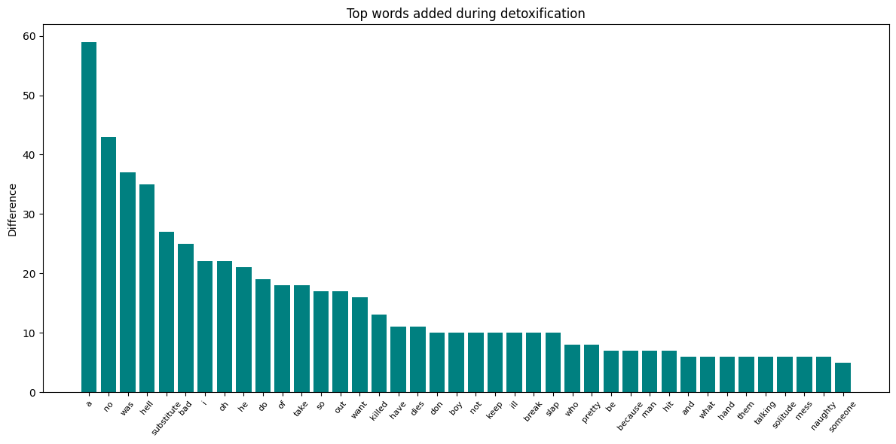

# Report
## Introduction
This document contains an overview of my final solution regarding the text detoxification problem
## Data analysis
The given data is comprised of pairs of pieces of text, one is written in toxic style, the other one - is rather neutral. Toxicity scores are provided as an evaluation of how toxic a certain text is. Most of the entries consist of 1-3 sentences, having a total length of 50 or less words:


The dataset contains two columns with text, `reference` and `translation`, however the relative toxicity of the pair of texts in these columns is inconsistent. For this reason the text is swapped between these columns on some rows, in order to have toxic text only in `reference` column, and the neutral text in `translation` column. The toxicity scores distribution is presented below:


All the references ended up having toxicity score of 0.5 or more, whereas all the translations: 0.5 or less. The dataset contains a total of about 577k rows. The quality of the given text is arguably not the best for model training because of presence of inconsistent toxicity scoring and poor translations, hence it is expected to result in suboptimal model performance.

## Model Specification
The model used to train to detoxify text is a Text to text transfer transformer (T5) small (60M params). The model is being fed the text to detoxify without any transformations applied to the text. The output is generated according to the default generation strategy (greedy generation).

## Training Process
The model is being trained by `Seq2SeqTrainer` from transformers library. The input text and target translation are both getting tokenized and batched, and the loss is being calculated by the T5 model. Training parameters:
- lr = 5e-5
- epoch count: 10
- weight decay: 0.04
- half precision floats

The training set contains 80% of the dataset, the rest 20% are used as validation set.

## Evaluation
The fine-tuned T5 model was evaluated using a separetely trained T5-based toxicity regressor, which estimates text's toxicity score. Both the reference texts and the detoxified outputs were fed into the toxicity regressor, and then compared. The threshold of 0.5 was selected in order to classify the text as toxic.

Additionally a RoBERTa based [toxicity classifier](https://huggingface.co/s-nlp/roberta_toxicity_classifier) was used to evalute the results in a similar way, except no threshold is required in case of classifier model.

The evaluation was perfomed on the whole dataset.

## Results
The model has successfully learned to transform text to neutral style by rephrasing toxic bits of text. Manual insepction of the produced translations showed that the model mostly preserved the text's meaning and only makes minimal changes to the text to reduce its toxicity. The model also fails to detoxify more subtble cases of toxicity, where more complicated paraphrasing is required to neutralize the text.

The results of the evalutation performed using `T5-toxicity-regressor`:
- Total toxic references: 556930
- Total toxic translations: 151131
- 72.86% samples detoxified succesfully

The results of the evalutation performed using RoBERTa-based [toxicity classifier](https://huggingface.co/s-nlp/roberta_toxicity_classifier):
- Total toxic references: 478597
- Total toxic translations: 132633
- 72.29% samples detoxified succesfully

Relative amount of successful tranlations is pretty similar, but RoBERTa-based classifier seems to have a stricter policy for considering the text toxic.

The visualization of the most frequently words removed by the model was perfomed:


It mostly has the words that are toxic by themselves or are frequently used in toxic constructs. The model also tends to transform some unnecessary aspects of text, i.e. the words `is` or `will`, which made it to the top of removed words since the model contracted them as `'s` and `'ll`. For example:
```
That is really impressive and weird
```
gets translated to
```
that's really impressive and weird.
```

Additionaly the visualization of the most frequently introduced words was performed:



Which contains the words that were commonly used as replacements for their toxic couterparts. There are also other words, such as `it`, `be`, `do`, which are being used for paraphrasing text. As mentioned earlier, the model sometimes does unnecessary changes to the grammatical/syntactical structure of the text, resulting in this difference of words usage.